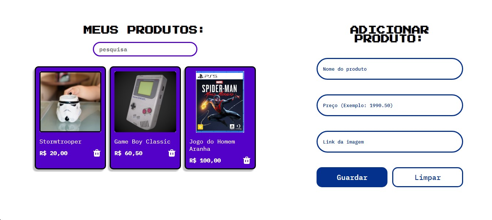

# 🎮 AluraGeek 🎮

Este é o projeto AluraGeek, desenvolvido para explorar o uso de funções assíncronas para realizar operações em uma API utilizando o json-server. Com este projeto, é possível criar, ler e deletar.

## Funcionalidades
O projeto AluraGeek implementa operações básicas de CRUD para gerenciamento de dados, possibilitando as seguintes funcionalidades:

- **Criar**: Adicionar novos registros na API.
- **Ler**: Obter e exibir informações salvas na API.
- **Deletar**: Remover registros.

Essas operações são executadas de forma assíncrona, permitindo uma experiência de usuário mais fluida e responsiva.

## Tecnologias Utilizadas

- **HTML/CSS**: Interface simples para interação com a API (opcional).
- **JavaScript**: Implementação das funções assíncronas.
- **json-server**: Servidor mock para criação de uma API REST simulada, ideal para desenvolvimento e testes.
